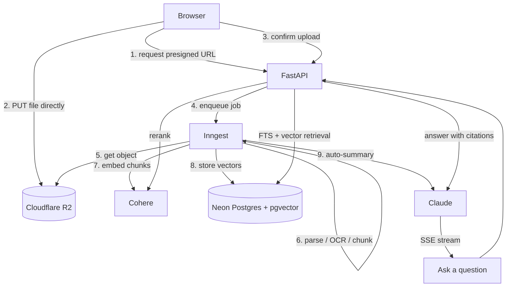

# StudyMate

https://studymate-web-psi.vercel.app/

**An education RAG SaaS where students upload their own materials and get cited Q&A,
auto-summaries, quizzes, flashcards (SM-2 spaced repetition), and progress tracking —
multilingual, built for global students.**

Upload a PDF, DOCX, TXT, or even a **photo of handwritten notes**; StudyMate parses,
chunks, embeds, and indexes it, then answers your questions **with citations back to the
source**, generates quizzes and flashcards from it, and tracks what you've learned. It
also does web-grounded research, shares subjects across a class or team, and reaches you
on Telegram.

---

## Table of contents

- [Features](#features)
- [Tech stack](#tech-stack)
- [Architecture](#architecture)
- [Project structure](#project-structure)
- [Getting started (local dev)](#getting-started-local-dev)
- [Deployment](#deployment)
- [Testing](#testing)
- [Roadmap / what's next](#roadmap--whats-next)
- [License & credits](#license--credits)

---

## Features

Every item below is backed by a real backend module (`backend/app/modules/*`) and a
frontend surface (`frontend/src/app/*`).

- **Cited Q&A over your own documents (RAG).** Ask questions against a subject's uploaded
  materials and get answers grounded in the text, each citing `(filename, chunk N)`.
  Retrieval is **hybrid** — Postgres full-text search + pgvector similarity fused with
  Reciprocal Rank Fusion, then a **Cohere rerank** pass — and answers **stream token by
  token** over SSE. Multi-turn **conversations** persist history per subject.
- **Document ingestion with OCR.** Upload PDF / DOCX / TXT, or **images** (photographed or
  scanned notes). Text-less/scanned PDFs and images run through **Claude vision OCR** and
  feed the same parse → chunk → embed → summarize pipeline. Uploads go **directly to
  Cloudflare R2** via a presigned URL, so large files bypass the serverless request-body
  limit, and processing runs **asynchronously** on Inngest (upload returns `pending`,
  resolves to `ready`/`failed`).
- **Auto-summaries.** Each document gets a language-aware auto-summary generated by Claude
  during ingestion.
- **Quiz generation.** Generate multiple-choice quizzes from a subject's materials
  (Claude tool-use), take them in the UI, and get scored.
- **Flashcards with SM-2 spaced repetition.** Generate flashcards from your materials and
  review them in a session UI driven by the **SM-2** scheduling algorithm.
- **Progress tracking.** A read-only per-subject progress page plus an overall dashboard.
- **Research mode.** Web-grounded answers via a **Tavily**-backed research agent (bounded
  agentic loop), separate from the private-materials Ask flow.
- **Org / team sharing.** Built on **Clerk organizations** — a teacher/admin can share
  subjects with their org and **assign quizzes**; members see assignments and submit
  attempts (assignments + submissions).
- **Billing & plans.** A provider-agnostic entitlement layer (Free / Pro / Business /
  Team) with enforced usage caps, wired to **Polar** checkout + signature-verified
  webhooks. Over-quota actions return `402` with a clear upgrade prompt.
- **Referrals.** Referral attribution grants bonus daily generations (no extra table or
  Polar product needed).
- **Telegram bot.** A linked student can DM the bot and get answers **over their own
  uploaded materials** (subject picker) or explicit **web research** — scoped so it can
  only ever reach the linking user's private content.
- **Multilingual UI.** `next-intl` with **English, Uzbek, Korean, and Russian** locales,
  plus language-aware answers and summaries.

---

## Tech stack

**Backend**
- Python 3.12 · FastAPI · SQLModel · Alembic
- Neon Postgres + **pgvector**
- **Clerk** for auth (JWT verification via JWKS)
- **Inngest** for async jobs (document ingestion)
- **Cohere** for embeddings (`embed-multilingual-v3.0`) and reranking
- **Anthropic / Claude** for generation and vision OCR
- **Cloudflare R2** for file storage (S3-compatible)
- **Polar** for billing (Merchant of Record)
- **Tavily** for research web search
- Optional: Sentry (error monitoring)

**Frontend**
- Next.js 15 (App Router) · React 19 · TypeScript
- Tailwind CSS + shadcn/ui (Base UI variant)
- TanStack Query
- next-intl (i18n)
- **Typed API client generated from the FastAPI OpenAPI schema** (`openapi-typescript` +
  `openapi-fetch`) — **no tRPC**, since the backend is Python
- Optional: Sentry, PostHog (both fully env-gated)

The stack is fixed by ADR — see `docs/DECISIONS.md` before changing it.

---

## Architecture

**Modular backend.** Each domain lives in `backend/app/modules/<domain>/` as
`router` + `service` + `schemas` + `models`. Business logic lives in **services**;
routers stay thin (auth/DB wiring and exception → HTTP-status translation only). **Every
DB query is scoped to the current owner** (tenant scoping), and org-shared content is
resolved through an explicit `OrgContext` derived from the verified Clerk token.

**The RAG pipeline.** Uploads never traverse the serverless function — the browser gets a
**presigned URL and PUTs the file straight to R2**, then confirms. Confirmation enqueues
an **Inngest** job that does the heavy work off the request path; retrieval fuses keyword
and vector search, reranks, and Claude answers **only from the retrieved excerpts**, with
citations.



Auth: the frontend attaches the Clerk session token as `Authorization: Bearer` on every
request; the backend verifies it against Clerk's JWKS. Missing service keys fail **loudly
at point of use** (a deploy mistake), while per-document failures degrade gracefully to
`status: failed` rather than crashing a request.

---

## Project structure

```
backend/
  app/
    core/        # config, db, auth, org, Inngest/R2/Polar/Clerk clients, Sentry
    modules/     # one folder per domain (router + service + schemas + models)
      subjects/  documents/  ask/  quiz/  flashcards/  progress/
      billing/   referral/   assignments/  research/  telegram/
    shared/      # cross-cutting helpers (language, datetime)
    main.py      # FastAPI app: router wiring, CORS, Inngest serve, health
  alembic/       # migrations
  tests/         # pytest
  api/index.py   # Vercel entrypoint (re-exports app.main:app)

frontend/
  src/
    app/         # Next.js App Router pages (dashboard, subjects, ask, quizzes,
                 #   flashcards, progress, research, assignments, team, billing, ...)
    components/  # UI + feature components (shadcn/ui, Base UI variant)
    lib/         # typed API client + tested pure helpers
    i18n/        # next-intl config
  messages/      # en / uz / ko / ru locale catalogs
```

---

## Getting started (local dev)

### Prerequisites
- Python 3.12, Node.js 20+
- Managed-service accounts as needed (Neon, Clerk, Cohere, Anthropic, R2, Inngest, Polar,
  Tavily). The app boots without most keys — features whose keys are unset fail only at
  the point they're used, so you can start with just a database + Clerk and add the rest
  incrementally.

### Backend (from `backend/`)
```bash
python -m venv .venv
.venv\Scripts\activate            # Windows  (macOS/Linux: source .venv/bin/activate)
pip install -r requirements.txt -r requirements-dev.txt

cp .env.example .env              # fill in real values (see the file's inline notes)
alembic upgrade head              # apply migrations to your DATABASE_URL

uvicorn app.main:app --reload     # API at http://localhost:8000, docs at /docs
pytest tests                      # run the test suite
ruff check .                      # lint
```

For async document processing in local dev, also run the Inngest dev server:
`npx inngest-cli@latest dev` (the app serves its functions at `/api/inngest`).

`.env.example` is the canonical list of every environment variable, each with an inline
note on what it's for and whether it's optional.

### Frontend (from `frontend/`)
```bash
npm install
cp .env.local.example .env.local  # set NEXT_PUBLIC_API_URL + Clerk keys

npm run dev                       # app at http://localhost:3000
npm run test                      # Vitest
npm run lint                      # ESLint
```

The typed API client is generated from the running backend's OpenAPI schema:
`npm run generate-api-types` (with the backend up on `127.0.0.1:8000`).

---

## Deployment

StudyMate deploys to **Vercel** as two projects from this one repo: the **Next.js
frontend** and the **FastAPI backend as a single Python function** (streaming enabled for
the SSE Ask endpoint). Async jobs run on **Inngest Cloud** (which calls back to
`/api/inngest`), and **Neon, Cloudflare R2, Clerk, Polar, Cohere, Anthropic, and Tavily**
are managed services configured via environment variables. Uploads go directly to R2, so
they're unaffected by the serverless body limit.

The full runbook — project layout, per-project env vars, Inngest/webhook wiring, CORS, and
migration handling — is in **[`docs/DEPLOYMENT.md`](docs/DEPLOYMENT.md)**. Live launch
steps (webhook registration, key rotation, the pending migration) are in
`docs/RELEASE_CHECKLIST.md`.

---

## Testing

- **Backend:** `pytest tests`. Tests are **offline by default** — DB/vector logic runs on
  in-memory SQLite and external services (Cohere, Claude, Clerk) are mocked. Tests that
  hit real Neon/Cohere/Claude are gated behind an explicit opt-in marker: `pytest -m live`
  (deselected on the default run). Lint with `ruff check .`.
- **Frontend:** `npm run test` (Vitest + Testing Library) covers the many extracted pure
  helpers in `src/lib` and key components. Type-check and lint with `tsc --noEmit` and
  `npm run lint`.
- **CI:** GitHub Actions runs ruff + pytest on push/PR to `main`/`develop` with no secrets
  (all external services are mocked in the default suite).

---

## Roadmap / what's next

The shipped product (build Phases 0–7) is feature-complete for its portfolio goal. The
ideas below are **proposals for how to extend it**, consolidated in
**[`docs/FUTURE.md`](docs/FUTURE.md)** (with full trade-offs). Each is a
problem → direction sketch, with effort noted where the source does.

**Product features**
- **Research answer persistence** — research answers are ephemeral today; add a session/
  answer store (mirroring Ask's `Conversation`/`ConversationTurn`) plus a history UI.
  *Medium.*
- **Research over your own materials + the web** — blend Tavily results with retrieval over
  the user's own chunks (prompt fusion, no new storage). *Medium.*
- **Telegram over org-shared subjects** — the bot is deliberately scoped to a user's own
  private subjects; extending it to org-shared content needs org resolution for a chat with
  no Clerk session. *Medium.*
- **Live Telegram "Connect" status** — flip the dashboard card without a manual refresh
  (poll or webhook signal). *Small.*

**B2B / teams**
- **Per-student assignment targeting** — assignments broadcast to the whole active org
  today; add targeting to specific members. *Medium.*
- **Team-plan seat enforcement** — a Team subscription currently lifts every org member
  regardless of seats purchased; compare Polar seat count against Clerk membership and
  gate. *Medium.*

**Billing**
- **Final plan-limit review before production**, and **cleanup of superseded sandbox Polar
  products** — both launch-gate/ops items (cross-referenced from `RELEASE_CHECKLIST.md`).

**Internationalization**
- **Native review of the uz / ko / ru catalogs** (drafts are LLM-generated; Russian plural
  forms especially). *Small — needs a human native speaker.*
- **Typed next-intl messages** — augment the `Messages` type from `en.json`; blocked on
  refactoring ~13 dynamic template-literal call sites first. *Medium.*
- **Clerk Uzbek UI localization** — blocked upstream until Clerk ships an Uzbek resource.
  *Trivial once it exists.*

**Infra / OCR**
- **Full-page rasterization of vector, text-less PDFs** — OCR covers the common
  embedded-image case; pure-vector PDFs would need a heavy renderer (poppler / PyMuPDF),
  deliberately not added to keep the dependency footprint minimal. *Small once a dependency
  is chosen.*
- **100 MB+ document uploads** — the current pipeline caps uploads at 20 MB and ingests a
  document in a **single Inngest step** (whole file in memory, all chunks embedded at once,
  summary truncated to the opening excerpt). Supporting very large files means addressing
  four bottlenecks — memory, Cohere throughput/rate limits, summary quality, and single-step
  duration — via a **streaming bounded-memory parse**, **batched embedding split across
  multiple Inngest steps** (durable + resumable), **map-reduce (hierarchical) summarization**
  so every Claude call stays within the context window, per-document progress state, and
  optional Inngest fan-out. Trade-offs: far more moving parts, real provider cost (needs
  per-plan size caps), higher latency, and lossier summaries. *Recommended: defer; if
  pursued, do batched-embedding + map-reduce first, then streaming + fan-out. Large.*

**Mobile — Phase 8 (deferred)**
- **Mobile app (PWA or native)** — a PWA pass (manifest + service worker + install prompt)
  over the existing responsive Next.js app is the simpler option; native is a separate
  project. *Large.*

See **[`docs/FUTURE.md`](docs/FUTURE.md)** for the full write-ups.

---

## License & credits

Built as a **portfolio project**. No open-source license is declared for this repository.

Project conventions live in [`CLAUDE.md`](CLAUDE.md); current build state in
[`docs/PROGRESS.md`](docs/PROGRESS.md).
